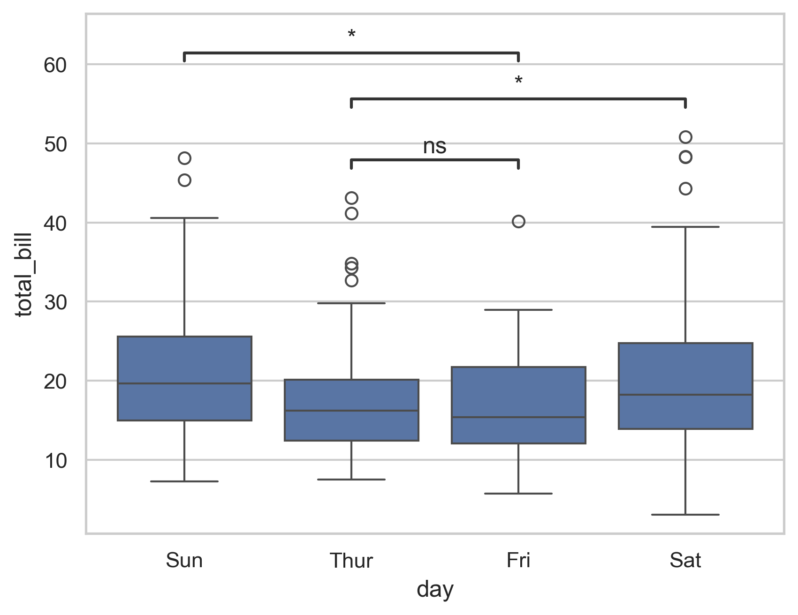

# statannotations Examples

Real-world examples of [statannotations](https://github.com/trevismd/statannotations) drawn from figures published in the [KISS-Matcher paper](https://arxiv.org/abs/2409.15615) (RA-L 2025).

---

## Installation

```bash
pip install statannotations seaborn matplotlib pandas numpy
```

> **Note:** If you want to use LaTeX-rendered tick labels (as in `plot_bufferx_poseest_time.py`), a system LaTeX installation is also required. To disable it, set `plt.rcParams['text.usetex'] = False` and use plain strings.

---

## How to use statannotations

Every script follows the same three-step pattern — just swap in your own DataFrame:

```python
from statannotations.Annotator import Annotator
import seaborn as sns

# Step 1. Draw the seaborn plot
ax = sns.boxplot(data=df, x=x, y=y, hue=hue, order=order, hue_order=hue_order)

# Step 2. Create the Annotator with the same arguments
annot = Annotator(ax, pairs, data=df, x=x, y=y, hue=hue, order=order, hue_order=hue_order)

# Step 3. Run the statistical test and annotate
annot.configure(test='Mann-Whitney', verbose=2)
annot.apply_test()
annot.annotate()
```

**`pairs`** is the list of groups to compare. The format depends on whether `hue` is used:

```python
# Without hue — each element is a tuple of two x-axis category values
pairs = [("Group A", "Group B"), ("Group A", "Group C")]

# With hue — each element is a tuple of (x_value, hue_value) pairs
pairs = [
    (("Single-thread", "FPFH"),  ("Single-thread", "Faster-PFH")),
    (("Multi-thread",  "FPFH"),  ("Multi-thread",  "Faster-PFH")),
]
```

---

## Gallery

| Basic box plot | Speed comparison | Pose est. time (log scale) |
|:-:|:-:|:-:|
|  |  |  |
| `example_basic_boxplot.py` | `plot_speed.py` | `plot_bufferx_poseest_time.py` |

| Translation error | Rotation error | Success rate (bar plot) |
|:-:|:-:|:-:|
|  |  |  |
| `plot_trans_error.py` | `plot_rot_error.py` | `plot_success_rate.py` |

| SLAM w/ vs. w/o loop closure | |
|:-:|:-:|
|  | |
| `plot_vggt_slam_lc.py` | |

---

## Scripts

### `example_basic_boxplot.py` — Minimal example (no hue)

The simplest starting point. Uses seaborn's built-in `tips` dataset — no files needed.

```python
df = sns.load_dataset("tips")   # replace with your own pd.DataFrame
x, y = "day", "total_bill"
order = ['Sun', 'Thur', 'Fri', 'Sat']

ax = sns.boxplot(data=df, x=x, y=y, order=order)
annot = Annotator(ax, [("Thur", "Fri"), ("Thur", "Sat"), ("Fri", "Sun")],
                  data=df, x=x, y=y, order=order)
annot.configure(test='Mann-Whitney', text_format='star', loc='inside', verbose=2)
annot.apply_test()
ax, test_results = annot.annotate()
```

**DataFrame:** `{'day': str, 'total_bill': float}`

---

### `plot_speed.py` — Multi-hue box plot

Compares feature extraction time of FPFH vs. Faster-PFH under single/multi-thread and w/ or w/o ground segmentation.

**DataFrame:** `{'thread': str, 'alg_name': str, 'time': float [s]}`

```bash
python3 plot_speed.py
```

---

### `plot_bufferx_poseest_time.py` — Log scale + LaTeX labels

Compares pose estimation time of RANSAC vs. KISS-Matcher across five datasets on a **log y-axis**.

```python
plt.rcParams['text.usetex'] = True   # enable LaTeX; set False to disable
ax = sns.boxplot(...)
plt.yscale('log')
annot = Annotator(ax, pairs, ...)
annot.configure(test='Mann-Whitney', verbose=2)
annot.apply_test()
annot.annotate()
```

**DataFrame:** `{'Dataset': str, 'alg_name': str, 'PoseEst_time': float [s]}`

```bash
python3 plot_bufferx_poseest_time.py
```

---

### `plot_trans_error.py` / `plot_rot_error.py` — Pose error box plots

Translation error [m] and rotation error [deg] across KITTI and MulRan datasets. Set `consider_only_succeeded = True` to include only successful registrations.

**DataFrame:** `{'Dataset': str, 'alg_name': str, 'time': float}`

```bash
python3 plot_trans_error.py
python3 plot_rot_error.py
```

---

### `plot_success_rate.py` — Bar plot

Demonstrates that statannotations works identically with `sns.barplot` — just swap `boxplot` for `barplot`.

**DataFrame:** `{'Dataset': str, 'Alg. name': str, 'time': float [%]}`

```bash
python3 plot_success_rate.py
```

---

### `plot_vggt_slam_lc.py` — Two-group comparison

ATE [m] with vs. without loop closure across different window sizes. A minimal two-group example.

**DataFrame:** `{'Window size': str, 'alg_name': str, 'time': float [m]}`

```bash
python3 plot_vggt_slam_lc.py
```

---

## File Structure

```
.
├── example_basic_boxplot.py      # Minimal statannotations example (no hue)
├── plot_speed.py                 # Box plot: speed comparison, multi-hue
├── plot_bufferx_poseest_time.py  # Box plot: log scale + LaTeX labels
├── plot_trans_error.py           # Box plot: translation error
├── plot_rot_error.py             # Box plot: rotation error
├── plot_success_rate.py          # Bar plot: success rate
├── plot_vggt_slam_lc.py          # Box plot: w/ vs. w/o loop closure
├── variables.py                  # Shared plot styling constants
├── data/                         # Input data
└── output/
    ├── for_README/               # Representative figures (tracked by git)
    └── ...                       # Other generated plots (gitignored)
```

---

## Citation

If you find these examples useful, please consider citing:

```bibtex
@article{lim2025kissmatcher,
  title   = {KISS-Matcher: Fast and Robust Point Cloud Registration Revisited},
  author  = {Lim, Hyungtae and Shi, Daebeom and Kim, Gunhee and Kim, Seungwon and Lu, Fan and Chen, Guang and Spring, Julien and Siegwart, Roland and Pfändtner, Jens and Schindler, Konrad and others},
  journal = {IEEE Robotics and Automation Letters},
  year    = {2025}
}
```
