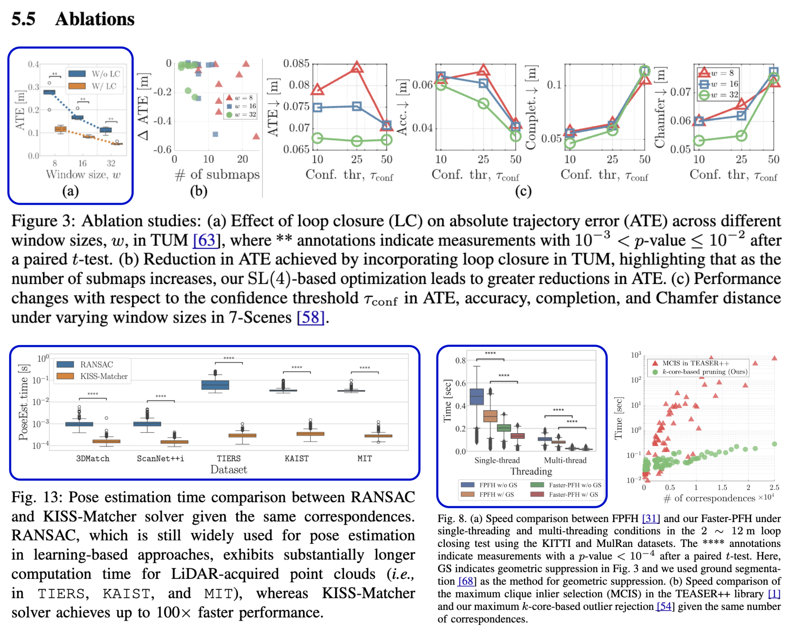
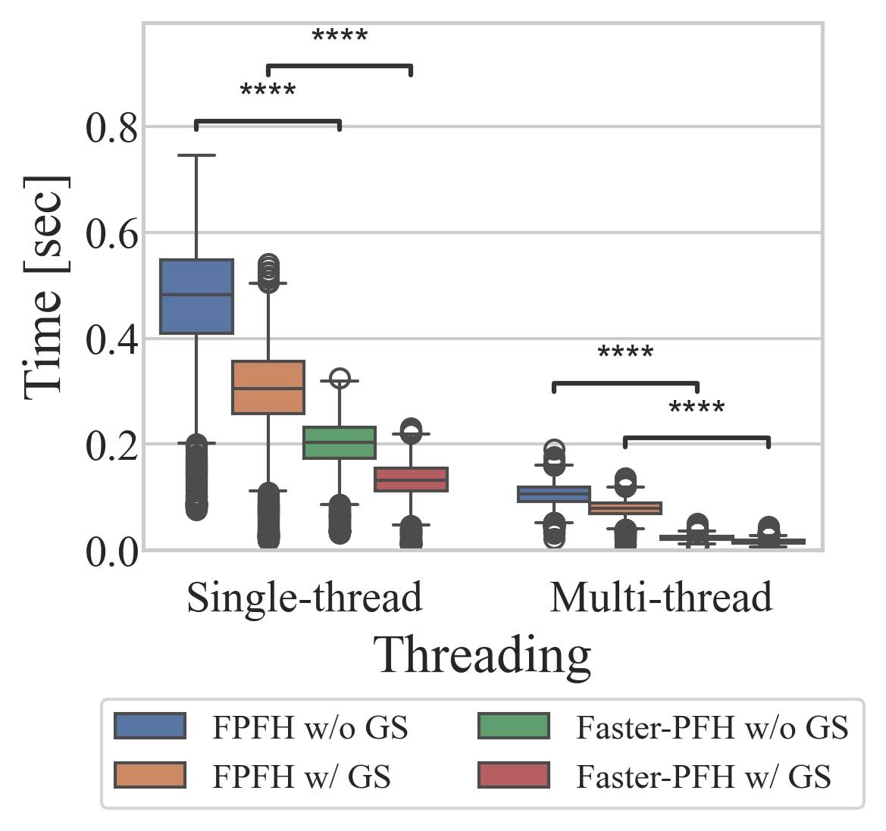
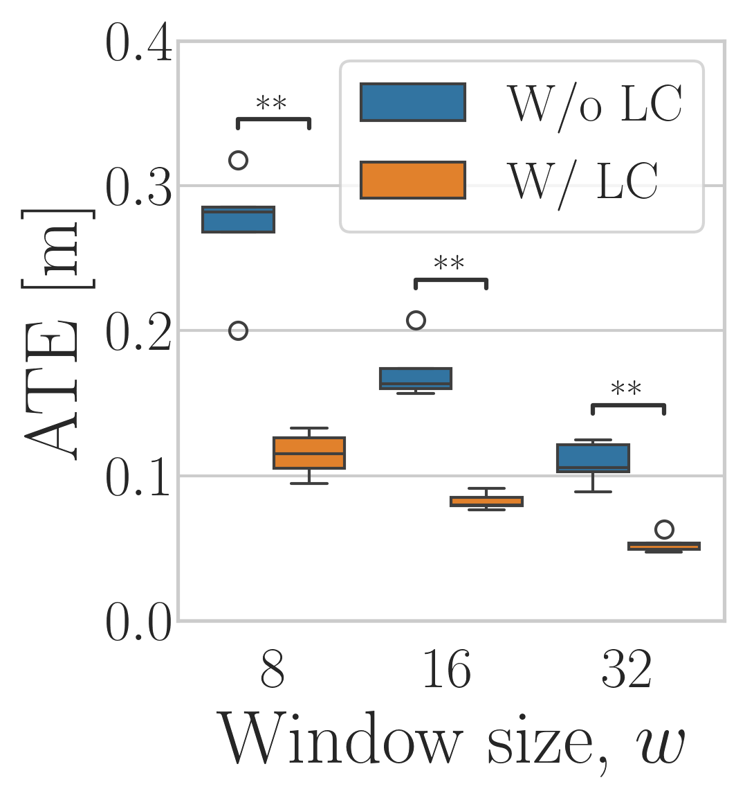
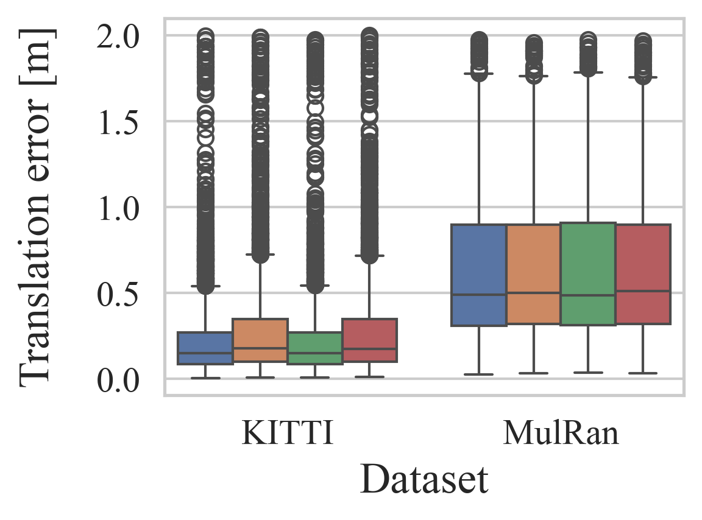
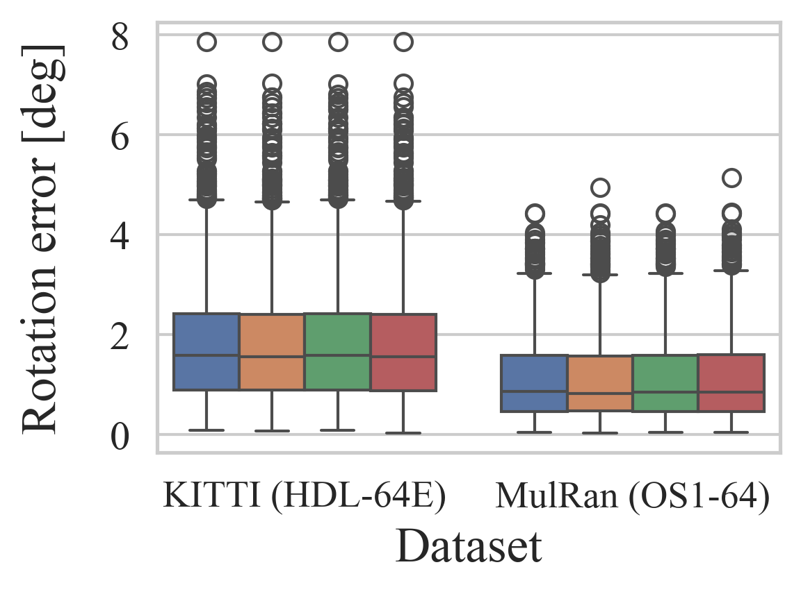
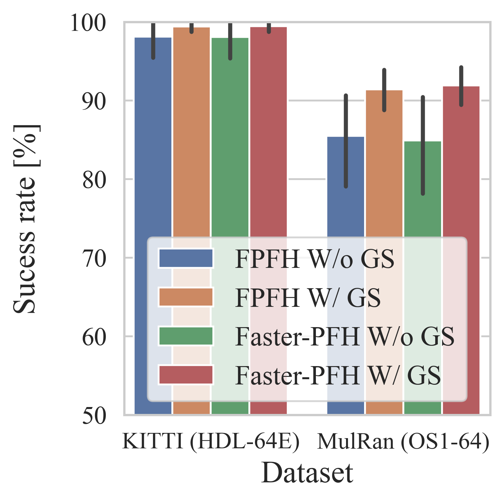
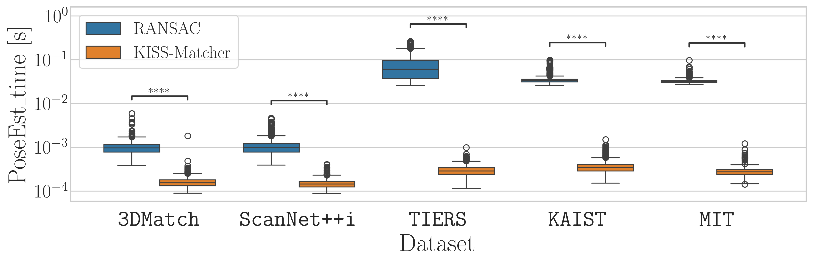

<div align="center">
    <h1><code>statannotations</code> Examples — Real-world Paper Figures</h1>
    <a href="https://www.python.org/"></a>
    <a href="https://github.com/trevismd/statannotations"></a>
    <a href="https://arxiv.org/pdf/2409.15615"></a>
    <a href="https://arxiv.org/pdf/2505.12549"></a>
    <a href="https://arxiv.org/pdf/2601.02759"></a>
    <br />
    <br />
    <p align="center"></p>
    <p><strong><em>Tutorials for publication-ready statistical plots</em></strong></p>
</div>

---

## Installation

```bash
pip install statannotations seaborn matplotlib pandas numpy
```

> **Note:** If you want to use LaTeX-rendered tick labels (as in `plot_bufferx_poseest_time.py`), a system LaTeX installation is also required. To disable it, set `plt.rcParams['text.usetex'] = False` and use plain strings.

---

## How to use statannotations

Every script follows the same three-step pattern — just swap in your own DataFrame:

```python
from statannotations.Annotator import Annotator
import seaborn as sns

# Step 1. Draw the seaborn plot
ax = sns.boxplot(data=df, x=x, y=y, hue=hue, order=order, hue_order=hue_order)

# Step 2. Create the Annotator with the same arguments
annot = Annotator(ax, pairs, data=df, x=x, y=y, hue=hue, order=order, hue_order=hue_order)

# Step 3. Run the statistical test and annotate
annot.configure(test='Mann-Whitney', verbose=2)
annot.apply_test()
annot.annotate()
```

**`pairs`** is the list of groups to compare. The format depends on whether `hue` is used:

```python
# Without hue — each element is a tuple of two x-axis category values
pairs = [("Group A", "Group B"), ("Group A", "Group C")]

# With hue — each element is a tuple of (x_value, hue_value) pairs
pairs = [
    (("Single-thread", "FPFH"),  ("Single-thread", "Faster-PFH")),
    (("Multi-thread",  "FPFH"),  ("Multi-thread",  "Faster-PFH")),
]
```

---

## Gallery

| Speed comparison | w/ vs. w/o loop closure |
|:-:|:-:|
|  |  |
| `plot_speed.py` | `plot_vggt_slam_lc.py` |

| Translation error | Rotation error |
|:-:|:-:|
|  |  |
| `plot_trans_error.py` | `plot_rot_error.py` |

| Success rate (bar plot) |
|:-:|
|  |
| `plot_success_rate.py` |

| Pose est. time (log scale) |
|:-:|
|  |
| `plot_bufferx_poseest_time.py` |

---

## Citation

If you find these examples useful, please consider citing:

```bibtex
@inproceedings{lim2025kiss,
  title={{KISS-Matcher: Fast and robust point cloud registration revisited}},
  author={Lim, Hyungtae and Kim, Daebeom and Shin, Gunhee and Shi, Jingnan and Vizzo, Ignacio and Myung, Hyun and Park, Jaesik and Carlone, Luca},
  booktitle={2025 IEEE International Conference on Robotics and Automation (ICRA)},
  pages={11104--11111},
  year={2025},
  organization={IEEE}
}

@article{maggio2025vggt,
  title={VGGT-SLAM: Dense rgb slam optimized on the SL(4) manifold},
  author={Maggio, Dominic and Lim, Hyungtae and Carlone, Luca},
  journal={arXiv preprint arXiv:2505.12549},
  year={2025}
}

@article{lim2026towards,
  title={Towards Zero-Shot Point Cloud Registration Across Diverse Scales, Scenes, and Sensor Setups},
  author={Lim, Hyungtae and Seo, Minkyun and Carlone, Luca and Park, Jaesik},
  journal={arXiv preprint arXiv:2601.02759},
  year={2026}
}
```
